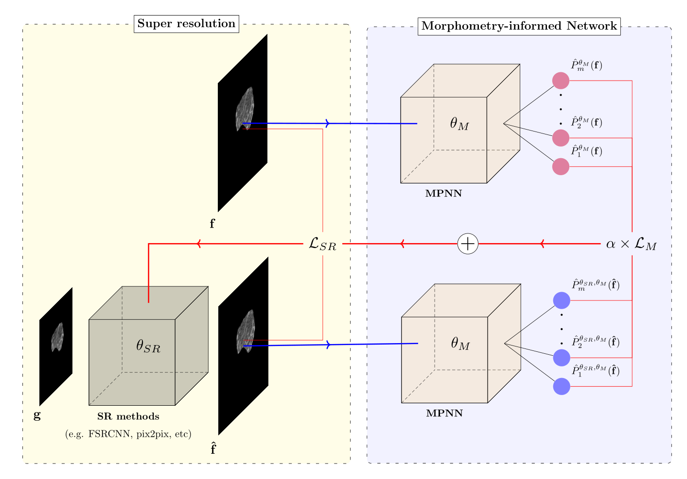

# Morphometry-informed for Computed Tomography Super Resolution (MiCT-SR)
<span align="center"></span>

## Dataset

The dataset presented in PRL can be downloaded at the following link: https://drive.google.com/file/d/10r-n3qJH4NcndisK1jRrehJu9O3MX5w-/view?usp=sharing

Once downloaded please unzip it in order to have a data folder within the repository.

## Prerequisites

Check Requirements file to find every packages required.
```
pip install -r requirements.txt
```

## Inference

To use a pre-trained MiCT, use inference.py

## Training from scratch

To train from scratch, use train.py

## Cross-validation

To reproduct the result of the paper, use cross-validation.py that performs training, validation and testing. 


